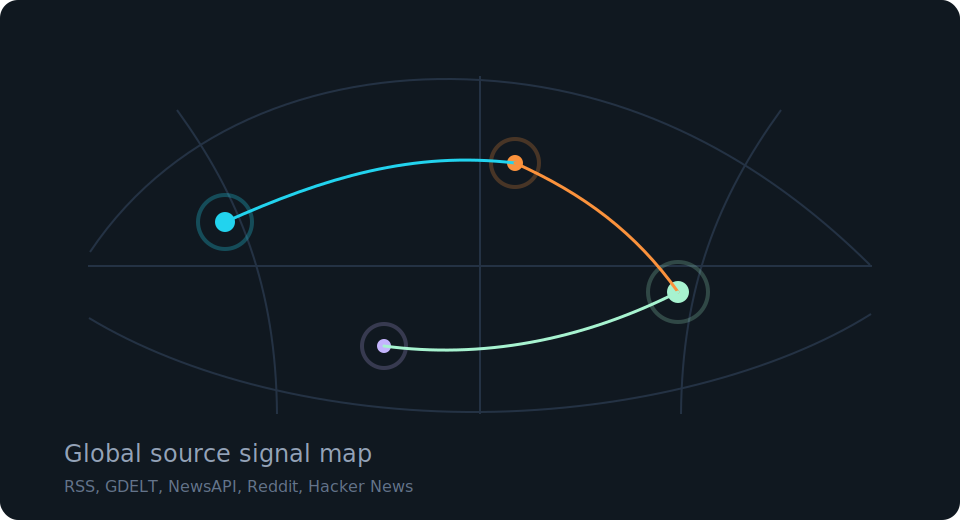
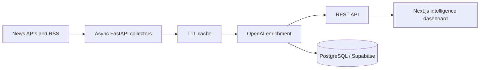

# Global AI News Tracker

Global AI News Tracker is a production-style AI news intelligence platform that collects global AI news, enriches it with AI summaries and classification, and presents trends in a modern SaaS dashboard inspired by Perplexity, Linear, Notion, OpenAI, and Vercel.



## Features

- Real-time AI news aggregation from NewsAPI, GDELT, Google News RSS, Reddit AI communities, and Hacker News.
- OpenAI-powered summarization, categorization, sentiment detection, keyword extraction, and multilingual labeling.
- Categories for LLMs, AI hardware, startups, robotics, regulation, open-source AI, research, tools, finance, and coding.
- Trending analytics for company mentions, topic frequency, article velocity, sentiment, source distribution, and country signal.
- Responsive dark-mode Next.js dashboard with smooth transitions, loading-friendly data fallbacks, and a polished portfolio UI.
- Search, category filters, language filters, source filters, and newest/popularity sorting.
- AI Daily Briefing page with executive summary, trend analysis, important events, and future impact.
- Browser-local bookmarks and reading history.
- Deployment-ready structure for Vercel, Render/Railway, and Supabase/PostgreSQL.

## Tech Stack

- Frontend: Next.js, TypeScript, Tailwind CSS, Framer Motion, Recharts, lucide-react
- Backend: FastAPI, async httpx, OpenAI SDK, feedparser, tenacity
- Database: PostgreSQL schema, compatible with Supabase
- Deployment: Vercel frontend, Render or Railway backend

## Project Structure

```text
global-ai-news-tracker/
  frontend/      Next.js dashboard
  backend/       FastAPI API, collectors, enrichment, analytics
  database/      PostgreSQL schema
  scripts/       Local helper scripts
  docs/          Architecture notes and diagrams
  render.yaml    Render backend deployment blueprint
```

## Architecture



## Local Setup

### 1. Backend

```bash
cd backend
cp .env.example .env
python -m venv .venv
source .venv/bin/activate
pip install -r requirements.txt
uvicorn app.main:app --reload --port 8000
```

Optional API keys:

```env
OPENAI_API_KEY=your_openai_key
NEWS_API_KEY=your_newsapi_key
ENABLE_LIVE_FETCH=true
```

Without keys, the backend still serves sample data so the portfolio demo remains usable.

### 2. Frontend

```bash
cd frontend
cp .env.example .env.local
npm install
npm run dev
```

Open [http://localhost:3000](http://localhost:3000).

## API Endpoints

- `GET /health` service health check
- `GET /api/news` latest enriched news
- `GET /api/news?q=OpenAI&category=LLMs&language=English` filtered news
- `GET /api/analytics` trend dashboard data
- `GET /api/briefing` AI analyst briefing payload

## Deployment

### Frontend on Vercel

1. Import the `frontend` directory as the Vercel project root.
2. Set `NEXT_PUBLIC_API_BASE_URL` to the deployed backend URL.
3. Deploy with the default Next.js build command.

### Backend on Render or Railway

1. On Render, choose **New +** -> **Blueprint**.
2. Connect this GitHub repository.
3. Render reads `render.yaml` and deploys the FastAPI backend from `backend/`.
4. Deploy once without API keys, then optionally add `OPENAI_API_KEY` and `NEWS_API_KEY`.
5. Add the Render backend URL to Vercel as `NEXT_PUBLIC_API_BASE_URL`.

More details are in `docs/live-deployment.md`.

### Database on Supabase

Run `database/schema.sql` in the Supabase SQL editor. For production ingestion, persist enriched articles after the OpenAI enrichment step and add pgvector for semantic search.

## Future Improvements

- Add Reddit and Hacker News authenticated collectors.
- Persist articles and bookmarks in Supabase with user accounts.
- Add pgvector-powered RAG chat for questions like “What happened in AI today?”
- Add daily email newsletter generation.
- Add push notifications for breaking AI news.
- Add background workers and queues for high-volume ingestion.

## Portfolio Notes

This project is intentionally structured to look clean on GitHub: modular services, clear environment variables, graceful API fallbacks, responsive UI, deployment notes, and a recruiter-friendly product narrative.
