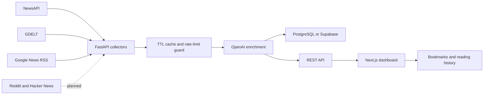

# Architecture

## Data Flow

1. Collectors query AI keywords across configured sources.
2. URLs are deduplicated with stable hashes.
3. OpenAI enrichment generates summaries, categories, sentiment, keywords, companies, and multilingual labels.
4. API responses are cached for the configured refresh interval to reduce rate-limit pressure.
5. Next.js renders the dashboard, polls the API every three minutes, and persists personal actions in local storage.

## Scalability Notes

- Move collector execution to a queue worker for high-volume production ingestion.
- Store article embeddings in Supabase pgvector for semantic search and RAG chat.
- Add user authentication before moving bookmarks from local storage to Postgres.
- Use Vercel ISR for public dashboards and Render/Railway background workers for ingestion.
